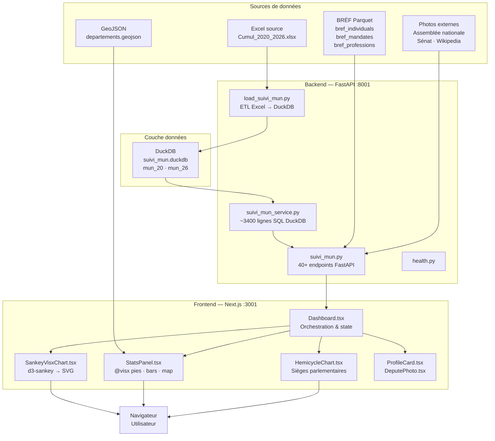
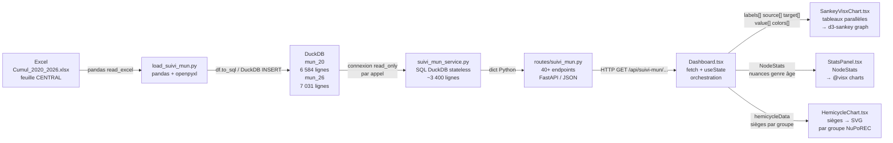
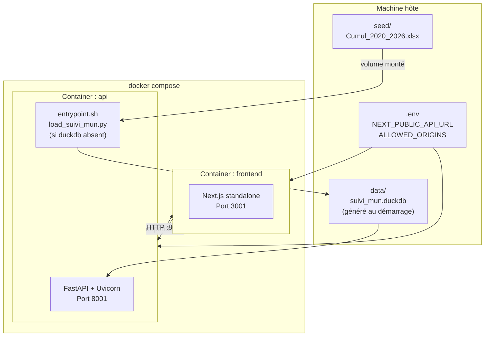
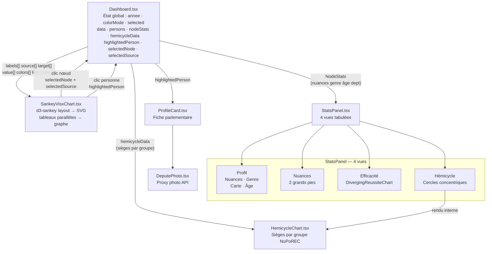
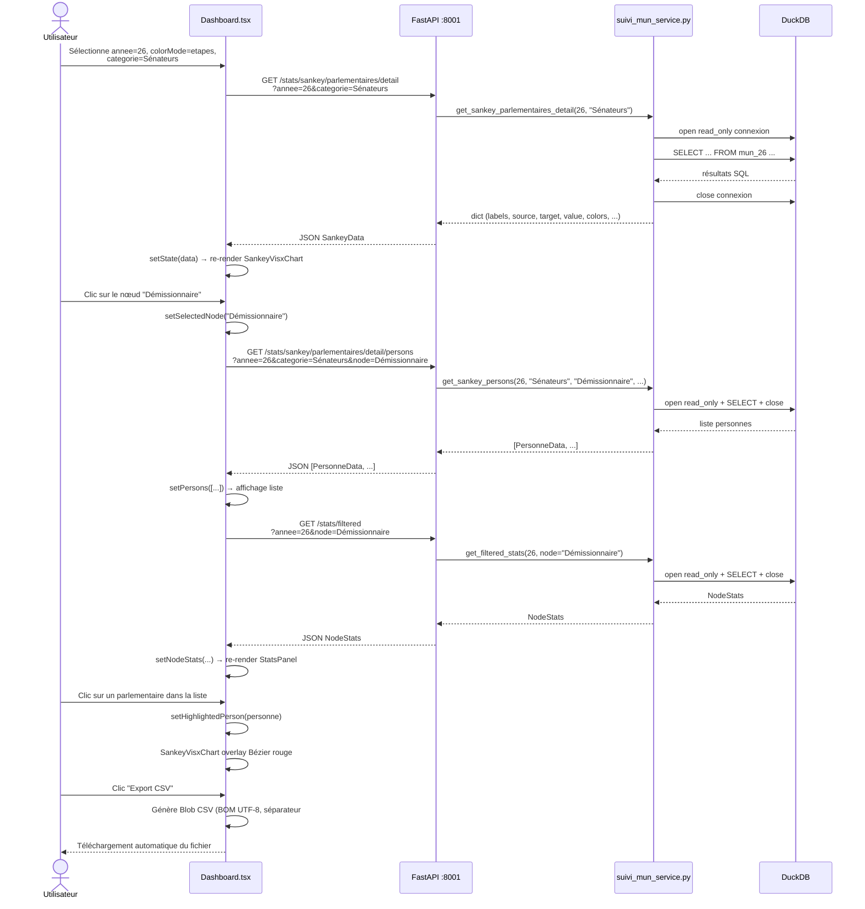

# cumulAnael

**Dashboard interactif d'analyse du cumul des mandats et des démissions des parlementaires français élus à une fonction exécutive municipale lors des élections municipales 2020 & 2026.**


---

## Aperçu

cumulAnael est une application web d'analyse politique permettant d'étudier les trajectoires des parlementaires français (députés et sénateurs) élus à une fonction exécutive municipale lors des élections municipales de 2020 et 2026. L'application modélise et visualise deux phénomènes distincts : le **cumul de mandats** (un parlementaire conserve son mandat tout en occupant une fonction exécutive municipale) et les **démissions** (un parlementaire renonce à son mandat parlementaire à la suite de son élection municipale).

Les données, issues d'un fichier Excel de suivi constitué manuellement, alimentent une base analytique DuckDB interrogée par une API FastAPI. Le frontend Next.js présente ces données sous forme de **diagrammes Sankey interactifs**, d'une **visualisation hémicycle parlementaire**, de **cartes départementales** et de **statistiques profilées** (nuances politiques, genre, âge, fonctions).

L'application couvre deux millésimes distincts (2020 et 2026) accessibles via un sélecteur d'année, et propose un enrichissement optionnel des profils parlementaires via la base de données BRÉF (photos, biographies, mandats antérieurs).

---

## Sommaire

- [Fonctionnalités principales](#fonctionnalités-principales)
- [Architecture globale](#architecture-globale)
- [Stack technique](#stack-technique)
- [Flux de données](#flux-de-données)
- [Pré-requis](#pré-requis)
- [Installation locale](#installation-locale)
- [Lancement](#lancement)
- [Déploiement Docker](#déploiement-docker)
- [Configuration](#configuration)
- [Structure du projet](#structure-du-projet)
- [API — Endpoints](#api--endpoints)
- [Composants frontend](#composants-frontend)
- [Séquence d'interaction utilisateur](#séquence-dinteraction-utilisateur)
- [Modèle de données](#modèle-de-données)
- [Visualisations](#visualisations)
- [Données](#données)
- [Limitations connues](#limitations-connues)
- [Roadmap](#roadmap)
- [Contribution](#contribution)
- [Licence & Crédits](#licence--crédits)

---

## Fonctionnalités principales

- **Diagrammes Sankey interactifs** avec deux modes de coloration distincts :
  - Mode `etapes` : chaque nœud est coloré par étape du parcours
  - Mode `origine` : les flux sont colorés selon la situation d'entrée (sortant CM-CC / CM / sans mandat préalable)
- **Filtres avancés** : nuance politique, département, civilité, tranche d'âge, statut d'élu, catégorie parlementaire
- **Listes nominatives** : clic sur un nœud Sankey pour afficher la liste des personnes concernées avec leur parcours complet
- **Mise en évidence individuelle** : sélection d'un parlementaire pour tracer son parcours en courbe de Bézier rouge superposée au Sankey
- **Hémicycle parlementaire** : visualisation des sièges répartis par groupe NuPoREC, avec mise en évidence des démissionnaires
- **Tableau de bord statistique** (StatsPanel) en 4 vues tabulées :
  - Profil (nuances, genre, carte départements, tranches d'âge)
  - Nuances politiques croisées
  - Efficacité par nuance (diverging chart élu/battu)
  - Hémicycle (cercles concentriques sectoriels)
- **Export CSV** : export des listes nominatives filtrées (encodage UTF-8 BOM, séparateur `;`)
- **Export PNG** : capture haute résolution (canvas 2×) du diagramme Sankey avec fond blanc
- **Enrichissement BRÉF** : photos de parlementaires proxiées depuis l'Assemblée nationale, le Sénat ou Wikipedia, avec profils biographiques
- **Comparaison 2020 vs 2026** : sélecteur d'année et endpoint `/stats/evolution` pour comparer les deux scrutins
- **Carte GeoJSON** : répartition géographique des élus en cumul par département (France métropolitaine + DOM-TOM)
- **Déploiement Docker** compatible Dokploy avec build multi-stage

---

## Architecture globale



L'architecture suit un découpage en quatre couches strictement séparées. La couche source produit les données brutes (Excel manuel, Parquet BRÉF, GeoJSON statique, photos externes). La couche données centralise tout dans une base DuckDB embarquée. Le backend FastAPI expose les données via des routes REST. Le frontend Next.js orchestre l'affichage et gère l'état applicatif.

Le backend est **stateless** : chaque appel `_query()` dans `suivi_mun_service.py` ouvre une connexion DuckDB en mode `read_only=True` puis la ferme immédiatement. Il n'y a ni pool de connexions ni cache SQL côté serveur. Cette approche simplifie le déploiement et garantit la cohérence des données lors des rechargements de la base.

---

## Stack technique

### Backend

| Dépendance | Version | Rôle |
|---|---|---|
| Python | 3.12+ | Runtime |
| uv | dernière | Gestionnaire de paquets et environnements virtuels |
| FastAPI | ≥ 0.110.0 | Framework web ASGI |
| Uvicorn | ≥ 0.27.0 | Serveur ASGI (standard, avec extras) |
| DuckDB | ≥ 1.4.3 | Base analytique embarquée, connexion stateless read-only |
| Pydantic | ≥ 2.6.0 | Validation des données et sérialisation |
| pydantic-settings | ≥ 2.1.0 | Configuration via variables d'environnement |
| Pandas | ≥ 2.0.0 | Lecture et transformation du fichier Excel (ETL) |
| OpenPyXL | ≥ 3.1.5 | Moteur de lecture Excel pour Pandas |
| httpx | ≥ 0.28.1 | Client HTTP async pour le proxy de photos |
| PyArrow | ≥ 15.0.0 | Lecture des fichiers Parquet BRÉF |
| python-dotenv | ≥ 1.2.1 | Chargement des variables d'environnement depuis `.env` |

### Frontend

| Dépendance | Version | Rôle |
|---|---|---|
| Next.js | 16.2 | Framework React, App Router, output standalone |
| React | 19.1 | Librairie UI |
| TypeScript | 5.8 | Typage statique |
| Tailwind CSS | 4.1 | Styles utilitaires (avec @tailwindcss/postcss) |
| d3-sankey | 0.12.3 | Calcul du layout Sankey |
| @visx (11 packages) | 3.12 | Visualisations SVG (axis, group, hierarchy, legend, scale, shape, text, tooltip, zoom) |
| lucide-react | 0.511 | Icônes SVG |

> **Note** : `@visx` est installé avec `--legacy-peer-deps` car les packages 3.x ne déclarent pas officiellement React 19 comme peer dependency.

### Déploiement

| Outil | Rôle |
|---|---|
| Docker | Conteneurisation des deux services |
| docker-compose | Orchestration locale et production |
| Dokploy | Plateforme de déploiement ciblée (compatible docker-compose) |

---

## Flux de données



Le pipeline de données suit un chemin unidirectionnel. L'ETL (`load_suivi_mun.py`) s'exécute une seule fois (ou à chaque mise à jour du fichier Excel source) pour peupler la base DuckDB. En production, la base est montée en lecture seule par le conteneur API.

Le frontend reçoit les données Sankey sous forme de **tableaux parallèles** (chaque index `i` correspond à un lien entre `source[i]` et `target[i]` avec la valeur `value[i]`). `SankeyVisxChart.tsx` reconstruit le graphe d3-sankey à partir de ces tableaux avant le rendu SVG.

---

## Pré-requis

- **Python 3.12+** et [uv](https://docs.astral.sh/uv/) installés
- **Node.js 20+** et npm
- **Docker** et **Docker Compose** (pour le déploiement conteneurisé)
- Le fichier source Excel `data/Cumul_2020_2026.xlsx` (non versionné, à obtenir séparément)
- Optionnel : fichiers Parquet BRÉF dans `data/elections/bref/parquet/`

---

## Installation locale

### 1. Cloner le dépôt

```bash
git clone https://github.com/PrupoCG/cumulAnael.git
cd cumulAnael
```

### 2. Préparer le fichier de données

Placer le fichier Excel source dans le répertoire `data/` :

```bash
cp /chemin/vers/Cumul_2020_2026.xlsx data/
```

### 3. Installer les dépendances backend

```bash
uv sync
```

### 4. Générer la base DuckDB

```bash
uv run python scripts/load_suivi_mun.py
```

Cette commande lit `data/Cumul_2020_2026.xlsx` (feuille `CENTRAL`) et crée `data/suivi_mun.duckdb` avec les tables `mun_20` et `mun_26`.

### 5. Installer les dépendances frontend

```bash
cd frontend && npm install --legacy-peer-deps
```

L'option `--legacy-peer-deps` est nécessaire car `@visx` 3.x ne déclare pas officiellement React 19 comme peer dependency.

### 6. Configurer les variables d'environnement

```bash
cp .env.example .env
# Éditer .env si nécessaire
```

---

## Lancement

### Démarrage du backend

```bash
uv run uvicorn api.main:app --port 8001
```

L'API est accessible sur `http://localhost:8001`. La documentation interactive Swagger est disponible à `http://localhost:8001/docs`.

### Démarrage du frontend

```bash
cd frontend && npm run dev
```

Le frontend est accessible sur `http://localhost:3001`.

### Commandes utiles

```bash
# Build de production frontend
cd frontend && npm run build

# Linter Next.js
cd frontend && npm run lint

# Vérification de l'état de l'API
curl http://localhost:8001/api/health
```

---

## Déploiement Docker



### Lancement avec Docker Compose

```bash
# Lancer les deux services (build inclus)
docker compose up --build

# En arrière-plan
docker compose up --build -d

# Arrêt et suppression des conteneurs
docker compose down
```

### Comportement au démarrage

Le script `entrypoint.sh` du conteneur `api` vérifie la présence de `data/suivi_mun.duckdb`. Si la base est absente, il exécute `load_suivi_mun.py` pour la générer depuis `seed/Cumul_2020_2026.xlsx` avant de lancer Uvicorn. Cela permet un démarrage autonome en production sans étape d'initialisation manuelle.

### Build multi-stage frontend

Le `Dockerfile` du frontend utilise un build multi-stage :
1. **Stage `deps`** : installation des dépendances npm
2. **Stage `builder`** : build Next.js (`output: "standalone"`)
3. **Stage `runner`** : image allégée avec uniquement les fichiers du standalone

---

## Configuration

| Variable | Valeur par défaut | Service | Description |
|---|---|---|---|
| `API_HOST` | `0.0.0.0` | Backend | Interface d'écoute du serveur Uvicorn |
| `API_PORT` | `8001` | Backend | Port du serveur Uvicorn |
| `ALLOWED_ORIGINS` | `http://localhost:3001` | Backend | Origins autorisées pour CORS (séparées par des virgules) |
| `NEXT_PUBLIC_API_URL` | `http://localhost:8001` | Frontend | URL de l'API FastAPI côté navigateur |

### Fichier `.env.example`

```ini
API_HOST=0.0.0.0
API_PORT=8001
ALLOWED_ORIGINS=http://localhost:3001
NEXT_PUBLIC_API_URL=http://localhost:8001
```

En production avec un nom de domaine :

```ini
ALLOWED_ORIGINS=https://cumul.example.com
NEXT_PUBLIC_API_URL=https://api.cumul.example.com
```

---

## Structure du projet

```
cumulAnael/
├── api/
│   ├── __init__.py
│   ├── main.py                      # Application FastAPI + configuration CORS
│   ├── config.py                    # BaseSettings pydantic (lecture .env)
│   ├── routes/
│   │   ├── health.py                # GET /api/health
│   │   └── suivi_mun.py             # 604 lignes — 40+ endpoints sous /api/suivi-mun/
│   └── services/
│       └── suivi_mun_service.py     # ~3 400 lignes — toutes les requêtes SQL DuckDB
├── frontend/
│   ├── app/                         # Next.js App Router
│   │   ├── layout.tsx               # Layout racine
│   │   ├── page.tsx                 # Page d'accueil (landing)
│   │   ├── dashboard/
│   │   │   └── page.tsx             # Page principale du dashboard
│   │   └── globals.css              # Styles globaux Tailwind
│   ├── components/
│   │   ├── Dashboard.tsx            # Orchestrateur principal (state, fetch, filtres)
│   │   ├── SankeyVisxChart.tsx      # Rendu Sankey d3-sankey → SVG custom
│   │   ├── StatsPanel.tsx           # 4 vues statistiques @visx
│   │   ├── HemicycleChart.tsx       # Visualisation hémicycle parlementaire
│   │   ├── ProfileCard.tsx          # Fiche détaillée d'un parlementaire
│   │   ├── DeputePhoto.tsx          # Affichage photo via proxy API
│   │   ├── ChartErrorBoundary.tsx   # Error boundary React pour les charts
│   │   └── ChartSkeleton.tsx        # Squelette de chargement
│   ├── public/
│   │   └── data/
│   │       └── departements.geojson # Contours départements (France métro + DOM-TOM)
│   ├── package.json
│   ├── next.config.ts               # output: "standalone", headers, rewrites
│   ├── tsconfig.json
│   └── Dockerfile                   # Build multi-stage Node 20 → runner allégé
├── scripts/
│   └── load_suivi_mun.py            # ETL : Excel → DuckDB (mun_20 + mun_26)
├── seed/
│   └── Cumul_2020_2026.xlsx         # Copie seed pour le conteneur Docker
├── data/                            # Non versionné (.gitignore)
│   ├── Cumul_2020_2026.xlsx         # Fichier source de travail
│   ├── suivi_mun.duckdb             # Base générée par load_suivi_mun.py
│   └── elections/
│       └── bref/
│           └── parquet/             # Optionnel : enrichissement BRÉF
│               ├── bref_individuals.parquet
│               ├── bref_mandates.parquet
│               └── bref_professions.parquet
├── Dockerfile                       # Backend Python 3.12-slim
├── docker-compose.yml               # Orchestration 2 services (api + frontend)
├── entrypoint.sh                    # Init DuckDB si absent, puis uvicorn
├── .env.example                     # Template variables d'environnement
├── pyproject.toml                   # Métadonnées projet + dépendances Python
├── uv.lock                          # Lockfile uv
└── CLAUDE.md                        # Instructions pour Claude Code
```

---

## API — Endpoints

Tous les endpoints sont préfixés par `/api/suivi-mun/`.

> **Paramètre `annee`** : `20` pour les municipales 2020, `26` pour les municipales 2026.

### Photo, profil & timeline

| Méthode | Endpoint | Paramètres | Description |
|---|---|---|---|
| GET | `/photo` | `prenom`, `nom` | Photo du parlementaire (proxy AN → Sénat → Wikipedia, cache LRU) |
| GET | `/person-timeline` | `prenom`, `nom` | Parcours complet 2020–2026 |
| GET | `/bref-profile` | `prenom`, `nom` | Données biographiques et mandats BRÉF |

### Élus

| Méthode | Endpoint | Paramètres | Description |
|---|---|---|---|
| GET | `/elus/{annee}` | `limit` (≤ 5000), `offset` | Liste paginée des élus |
| GET | `/elus/{annee}/{elu_id}` | — | Détail individuel d'un élu |

### Sankey — mode `etapes` (par étapes du parcours)

| Méthode | Endpoint | Paramètres | Description |
|---|---|---|---|
| GET | `/stats/sankey/parlementaires/detail/options` | `annee` | Catégories disponibles |
| GET | `/stats/sankey/parlementaires/detail` | `annee`, `categorie` | Données Sankey par étapes |
| GET | `/stats/sankey/parlementaires/detail/persons` | `annee`, `categorie`, `node`, `source` | Personnes d'un nœud |

### Sankey — mode `origine` (flux par situation d'entrée)

| Méthode | Endpoint | Paramètres | Description |
|---|---|---|---|
| GET | `/stats/sankey/tracabilite/options` | `annee` | Catégories disponibles |
| GET | `/stats/sankey/tracabilite` | `annee`, `categorie` | Données Sankey par origine |
| GET | `/stats/sankey/tracabilite/persons` | `annee`, `categorie`, `node`, `origin`, `source` | Personnes d'un flux |

### Sankey — variantes

| Méthode | Endpoint | Paramètres | Description |
|---|---|---|---|
| GET | `/stats/sankey/ancrage/options` | `annee` | Options ancrage municipal |
| GET | `/stats/sankey/ancrage` | `annee`, `categorie` | Stratégies d'ancrage municipal |
| GET | `/stats/sankey/horizontal/options` | `annee` | Options ancrage horizontal |
| GET | `/stats/sankey/horizontal` | `annee`, `categorie` | Ancrage hors parlementaires (CR/CD) |
| GET | `/stats/sankey/nuances/options` | `annee` | Options nuances |
| GET | `/stats/sankey/nuances` | `annee`, `scope` | Nuances politiques croisées |
| GET | `/stats/sankey/fonctions` | `annee` | Cumul des fonctions exécutives |
| GET | `/stats/sankey/evolution` | `mandats`, `fonctions`, `annee` | Évolution des mandats |
| GET | `/stats/sankey` | `mandats`, `fonctions`, `annee` | Sankey principal D+S → municipales → cumul/démissions |
| GET | `/stats/sankey/export` | `annee`, filtres | Export CSV des trajectoires |

### Hémicycle & évolution

| Méthode | Endpoint | Paramètres | Description |
|---|---|---|---|
| GET | `/stats/hemicycle` | `annee` (défaut: 26), `categorie` (défaut: depute) | Données de visualisation hémicycle |
| GET | `/stats/evolution` | — | Comparaison 2020 vs 2026 |

### Stats filtrées

| Méthode | Endpoint | Paramètres | Description |
|---|---|---|---|
| GET | `/stats/filtered` | `annee`, `categorie`, `node`, `source`, `origin`, `nuance`, `departement`, `civilite`, `age_min`, `age_max`, `elu` | Stats agrégées avec filtres multiples |
| GET | `/stats/filtered/persons` | mêmes paramètres | Liste nominative filtrée |
| GET | `/stats/filtered/export` | `format` (json ou csv) + mêmes paramètres | Export CSV des personnes filtrées |

### Stats par année

| Méthode | Endpoint | Description |
|---|---|---|
| GET | `/stats/{annee}/cumuls` | Répartition des types de cumul |
| GET | `/stats/{annee}/nuances` | Répartition par nuance politique |
| GET | `/stats/{annee}/departements` | Élus en cumul par département |
| GET | `/stats/{annee}/age` | Distribution par tranche d'âge |
| GET | `/stats/{annee}/genre` | Répartition hommes/femmes |

### Health

| Méthode | Endpoint | Description |
|---|---|---|
| GET | `/api/health` | Retourne `{"status": "ok"}` |

> **Ordre de déclaration important** : dans `suivi_mun.py`, les routes Sankey spécifiques (préfixe `/stats/sankey/...`) sont déclarées **avant** les routes paramétrées `/stats/{annee}/...` pour éviter les conflits de matching FastAPI.

---

## Composants frontend



### Dashboard.tsx

Le composant `Dashboard.tsx` est l'orchestrateur central de l'application. Il gère l'ensemble de l'état applicatif et coordonne les appels API. Ses responsabilités principales sont :

- **Gestion de l'état** : année sélectionnée (`annee`), mode de coloration Sankey (`colorMode`), catégorie parlementaire (`selected`), données Sankey (`data`), personnes filtrées (`persons`), statistiques de nœud (`nodeStats`), données hémicycle (`hemicycleData`), parcours individuel surligné (`highlightedPerson`), nœud sélectionné (`selectedNode`, `selectedSource`)
- **Fetch dual** : selon le `colorMode`, l'application appelle soit `/stats/sankey/parlementaires/detail` (mode `etapes`) soit `/stats/sankey/tracabilite` (mode `origine`)
- **Calcul de hauteur Sankey** : ajustement dynamique selon le nombre de nœuds
- **Filtrage des personnes** : recherche par nom, prénom, département, commune, nuance
- **Export CSV** : génération BOM UTF-8, séparateur `;`, colonnes adaptées selon l'année (2020 vs 2026)
- **Export PNG** : rendu canvas à l'échelle 2× avec fond blanc
- **Path highlighting** : courbe de Bézier rouge continue traversant les nœuds du parcours d'un individu

### SankeyVisxChart.tsx

Ce composant prend les tableaux parallèles fournis par l'API et les convertit en graphe d3-sankey avant le rendu SVG. Les fonctionnalités clés incluent :

- Conversion des tableaux `labels[]`, `source[]`, `target[]`, `value[]` en objet graphe d3-sankey
- Alignement des colonnes via une fonction `nodeAlign` custom
- Tooltips au survol des nœuds et des liens
- Nœuds et liens cliquables pour filtrer les personnes
- Superposition du parcours individuel (courbe de Bézier rouge de 3px)

### StatsPanel.tsx

Le panneau de statistiques est organisé en 4 vues tabulées, toutes rendues en SVG via `@visx` :

1. **Profil** (vue par défaut) : 4 mini-charts en grille 2×2 — Pie des nuances politiques, Pie du genre, carte GeoJSON des départements colorisée par densité d'élus, graphique à barres horizontales des tranches d'âge
2. **Nuances** : deux grands pies côte à côte — nuances parlementaires nationales et NuPoREC (nuances politiques de regroupement)
3. **Efficacité** : `DivergingReussiteChart` — barres divergentes montrant pour chaque nuance le ratio d'élus (vert) vs battus (rouge)
4. **Hémicycle** : rendu interne du composant `HemicycleChart` intégré dans l'onglet stats

### HemicycleChart.tsx

La visualisation hémicycle utilise un algorithme en deux étapes :

1. **Répartition des sièges** : méthode du plus fort reste pour distribuer les sièges par groupe NuPoREC sur les rangées concentriques de l'hémicycle
2. **Remplissage greedy** : remplissage de l'extérieur vers l'intérieur, sans superposition ni trou, garantissant l'affichage de toutes les personnes

Les démissionnaires sont représentés en rouge vif. Les infobulle au survol affichent le groupe politique, l'effectif et le nom du parlementaire.

### ProfileCard.tsx et DeputePhoto.tsx

`ProfileCard.tsx` affiche la fiche détaillée d'un parlementaire (nom, prénom, département, commune, nuance, statut de cumul, fonctions exercées). `DeputePhoto.tsx` appelle le proxy `/photo` de l'API qui cherche la photo dans l'ordre : Assemblée nationale → Sénat → Wikipedia.

---

## Séquence d'interaction utilisateur



---

## Modèle de données

Les tables DuckDB `mun_20` et `mun_26` partagent le même schéma. Elles sont générées par `scripts/load_suivi_mun.py` depuis la feuille `CENTRAL` du fichier Excel source.

### Colonnes principales

| Colonne | Type DuckDB | Description |
|---|---|---|
| `ID` | VARCHAR | Identifiant unique de l'élu |
| `Année` | BIGINT | Année du scrutin municipal (2020 ou 2026) |
| `civilite_elu` | VARCHAR | Civilité (M. / Mme) |
| `nom_elu` | VARCHAR | Nom de famille |
| `prenom_elu` | VARCHAR | Prénom |
| `date_naissance_elu` | TIMESTAMP | Date de naissance |
| `age` | BIGINT | Âge au moment du scrutin |
| `position_cumul_1` | VARCHAR | Code de position cumul principal (D / CM / CC / CD) |
| `position_cumul_2` | VARCHAR | Code de position cumul secondaire |
| `statut_parlementaire` | VARCHAR | Statut au sein du parlement (Député, Sénateur, ...) |
| `statut_cr` | VARCHAR | Statut au conseil régional |
| `statut_cd` | VARCHAR | Statut au conseil départemental |
| `statut_cc_1` | VARCHAR | Statut à l'intercommunalité (CC/CA/CU/...) |
| `statut_cm_1` | VARCHAR | Statut au conseil municipal |
| `elu_cm` | BIGINT | Indicateur élu municipal (0/1) |
| `elu_cc_2` | BIGINT | Indicateur élu intercommunal 2 (0/1) |
| `t_departement` | VARCHAR | Département de la circonscription |
| `t_circo` | VARCHAR | Numéro de circonscription |
| `t_canton` | VARCHAR | Canton |
| `t_commune` | VARCHAR | Commune |
| `nuance_parlementaire` | VARCHAR | Nuance politique du mandat parlementaire |
| `nuance_regionale` | VARCHAR | Nuance politique régionale |
| `nuance_departementale` | VARCHAR | Nuance politique départementale |
| `nuance_municipale` | VARCHAR | Nuance politique municipale |
| `statut_candidature` | VARCHAR | Statut de candidature aux municipales |
| `mvmt_parlementaire` | VARCHAR | Mouvement parlementaire (Démissionnaire, Réélu, Non-candidat, ...) |
| `CUM_1` | VARCHAR | Type de cumul codifié (catégorie principale) |
| `CUM_3` | VARCHAR | Type de cumul codifié (catégorie étendue) |
| `EtudiantGD` | DOUBLE | Indicateur étudiant grande école (score) |
| `t_csp` | VARCHAR | Catégorie socio-professionnelle (NULL par défaut) |
| `statut_csp` | VARCHAR | Statut CSP (NULL par défaut) |

---

## Visualisations

### Diagrammes Sankey

Les diagrammes Sankey constituent la visualisation principale de l'application. Ils représentent les flux de parlementaires entre différentes étapes ou situations.

**Mode `etapes` (coloration par étape du parcours)**

Chaque nœud est coloré selon son étape dans le parcours : entrée dans les municipales, résultat électoral (élu/battu), décision post-élection (cumul/démission), type de fonction exercée. Ce mode met en évidence la structure du chemin typique d'un parlementaire.

**Mode `origine` (coloration par situation d'entrée)**

Les liens sont colorés selon la situation d'entrée du parlementaire : sortant avec mandat CM et CC, sortant avec seul mandat CM, ou sans mandat municipal préalable. Ce mode permet de visualiser comment l'ancrage municipal préexistant influence les trajectoires post-élection.

Les deux modes utilisent les mêmes données structurelles (tableaux parallèles) mais diffèrent dans les tableaux `colors[]` (couleurs des nœuds) et `link_colors[]` (couleurs des liens) retournés par l'API.

### Hémicycle

La visualisation hémicycle représente l'ensemble des sièges parlementaires pour une catégorie donnée (députés ou sénateurs), répartis en demi-cercle concentrique. Chaque cercle représente un parlementaire, coloré selon son groupe NuPoREC. Les démissionnaires sont mis en évidence en rouge vif.

L'algorithme de placement garantit :
- Aucune superposition entre cercles
- Aucun trou visuel dans la demi-couronne
- Remplissage de l'extérieur vers l'intérieur pour une densité maximale
- Respect exact de l'effectif de chaque groupe

### StatsPanel — 4 vues

**Vue Profil** : quatre mini-visualisations en grille 2×2 affichant les dimensions démographiques et géographiques du nœud sélectionné (ou de l'ensemble si aucun nœud n'est sélectionné).

**Vue Nuances** : deux grands pies comparant la distribution des nuances politiques parlementaires nationales avec les nuances NuPoREC de regroupement.

**Vue Efficacité** : graphique à barres divergentes (`DivergingReussiteChart`) centré sur zéro, montrant pour chaque nuance le nombre d'élus (barres vertes vers la droite) et de battus (barres rouges vers la gauche).

**Vue Hémicycle** : intégration du composant `HemicycleChart` avec secteurs colorés par groupe et rangées concentriques de cercles.

---

## Données

### Fichier source Excel

Le fichier `data/Cumul_2020_2026.xlsx` (feuille `CENTRAL`) est le point d'entrée unique du pipeline de données. Il est constitué manuellement à partir des sources officielles (Assemblée nationale, Sénat, Ministère de l'Intérieur). Il n'est pas versionné dans le dépôt Git.

### Base DuckDB

La base `data/suivi_mun.duckdb` est générée par `scripts/load_suivi_mun.py`. Elle contient deux tables :
- `mun_20` : 6 584 lignes (municipales 2020)
- `mun_26` : 7 031 lignes (municipales 2026)

La base n'est pas versionnée et doit être régénérée à chaque mise à jour du fichier Excel source.

### Enrichissement BRÉF (optionnel)

Les fichiers Parquet BRÉF (`bref_individuals.parquet`, `bref_mandates.parquet`, `bref_professions.parquet`) sont des extraits de la base de données biographiques BRÉF des parlementaires français. Leur présence dans `data/elections/bref/parquet/` est optionnelle. En leur absence, les endpoints `/bref-profile` et `/photo` fonctionnent en mode dégradé.

### GeoJSON départements

Le fichier `frontend/public/data/departements.geojson` contient les contours géographiques des départements français (métropole + DOM-TOM). Il est servi statiquement par Next.js et utilisé par `StatsPanel.tsx` pour afficher la carte de répartition des élus.

---

## Limitations connues

- **Absence de tests** : ni le backend ni le frontend ne disposent d'une suite de tests automatisés (ni unitaires, ni d'intégration). Toute modification du service SQL ou des composants de visualisation doit être vérifiée manuellement.
- **Absence de linter Python** : aucun outil de vérification de style Python (ruff, flake8, black) n'est configuré dans `pyproject.toml`. La cohérence stylistique du code backend repose uniquement sur les conventions de l'auteur.
- **Peer dependencies React 19** : `@visx` 3.x ne déclare pas officiellement React 19 comme peer dependency. L'installation requiert `--legacy-peer-deps` et pourrait nécessiter une mise à jour lors des prochaines versions majeures de `@visx`.
- **Backend stateless sans cache** : chaque requête API ouvre et ferme une connexion DuckDB. Ce modèle est simple et fiable pour les volumes de données actuels, mais pourrait devenir un goulot d'étranglement sous forte charge concurrente.
- **Données non versionnées** : le fichier Excel source et la base DuckDB ne sont pas versionnés, ce qui rend la reproductibilité dépendante d'un partage externe du fichier source.
- **Enrichissement BRÉF non garanti** : les photos et profils parlementaires dépendent de la disponibilité des sources externes (Assemblée nationale, Sénat, Wikipedia) et de la présence des fichiers Parquet BRÉF locaux.

---

## Roadmap

- Ajout d'une suite de tests backend (pytest) couvrant les principales fonctions de `suivi_mun_service.py`
- Ajout de tests frontend (Playwright ou Vitest) pour les composants de visualisation
- Configuration d'un linter Python (ruff) et d'un formateur (black) dans `pyproject.toml`
- Cache HTTP côté API pour les requêtes fréquentes (DuckDB + LRU en mémoire)
- Support des municipales complémentaires (mises à jour partielles entre deux scrutins)
- Internationalisation (i18n) de l'interface pour une diffusion académique
- Documentation OpenAPI enrichie avec exemples de réponses
- Export PDF du rapport de synthèse avec graphiques intégrés

---

## Contribution

Ce projet est développé et maintenu par un auteur unique. Les contributions externes sous forme de signalement de bugs ou de suggestions sont les bienvenues via les issues GitHub.

**Conventions à respecter pour toute contribution :**

- Tous les messages de commit doivent être rédigés en **français**
- Les pull requests doivent décrire précisément les modifications apportées et leur justification
- Aucune ligne `Co-Authored-By` ne doit être ajoutée dans les messages de commit
- Le style de code doit s'aligner sur les conventions existantes dans le dépôt

**Dépôt** : [https://github.com/PrupoCG/cumulAnael](https://github.com/PrupoCG/cumulAnael)

---

## Licence & Crédits

**Auteur** : Clément CHANUT GIRARDI

**Licence** : MIT

**Sources de données** :
- Fichier de suivi des mandats : constitution manuelle à partir des données officielles de l'Assemblée nationale, du Sénat et du Ministère de l'Intérieur
- Photos parlementaires : Assemblée nationale, Sénat, Wikipedia (sous licences respectives)
- Données biographiques : base BRÉF (optionnelle)
- Contours géographiques : GeoJSON départements France (domaine public)

---

*Projet cumulAnael — Analyse du cumul des mandats et des démissions des parlementaires élus à une fonction exécutive municipale (Municipales 2020 & 2026)*
